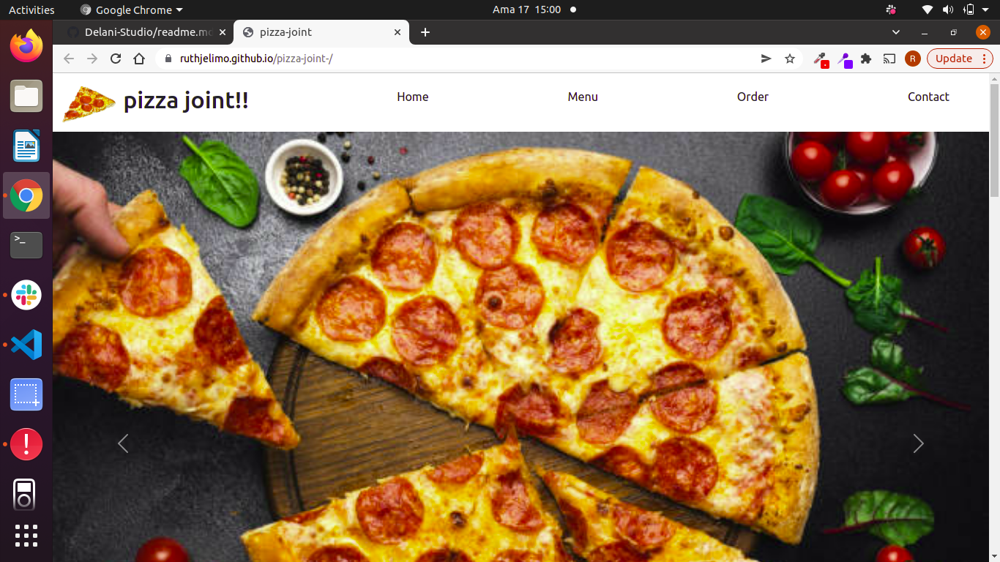

## Design

## Pizza-joint

By Ruth jelimo.

## Description

This a website for pizza-joint ,were one can make orders for their pizza having to choose the flavour,size and toppings.Also deliveries are done to those who want their orders be delivered or one can just pick up.

## Setup/Installation Requirements
1.Install visual studio code 
2.Git clone the repository 
3.Make sure the live server extension is installed 
4.Click on Go live

## Todo list
1.Design
2.Execute for view

## Technologies Used
1.HTML
2.CSS
3.BOOTSRAPS
4.JAVASCRIPTS

## Livelink
To clone the project use the link below 
https://github.com/ruthjelimo/pizza-joint-.git

To view the project here is my live link to the project
https://ruthjelimo.github.io/pizza-joint-/

## License
The project is under the license of MIT

